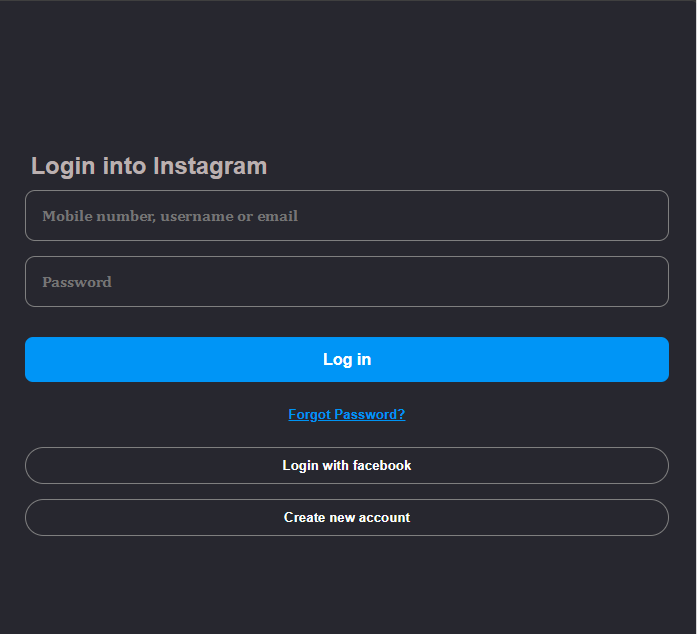
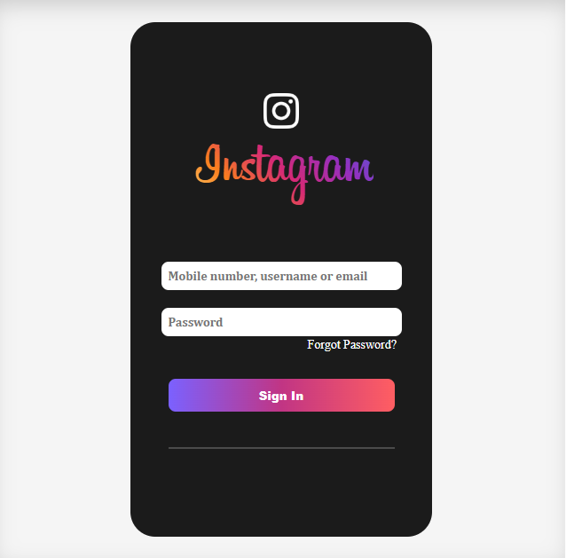

# 📸 Instagram Login Clone

A responsive Instagram login page built using **HTML5** and **CSS3**.

---

## ✨ Features

- 📱 Responsive Layout
- 🎨 Flexbox Layout
- 🖱️ Hover Effects
- 🚀 Button Animation
- ✍️ Input Focus Effect
- 📲 Mobile Friendly

---

## 🛠️ Technologies Used

- 🌐 HTML5
- 🎨 CSS3

---
## 🚀 Live Demo

https://heyrohitdev.github.io/css-clone-projects/01-instagram-login-clone
/

## 🖼️ Project Preview

### 💻 Desktop View



### 📱 Mobile View



---

## 📂 Folder Structure

```text
01-instagram-login-clone/
│
├── fonts/
│   ├── Billabong.ttf
│   └── images/
│
│── desktop.png
│── mobile.png
│
├── insta-logo.png
├── insta.html
├── insta.css
└── README.md
```

---

## 🚀 Future Improvements

- 🌙 Dark Mode
- 🔒 Form Validation
- ✨ Smooth Animations

---

## 👨‍💻 Author

**Rohit Chaudhary**

⭐ If you like this project, don't forget to star the repository!
