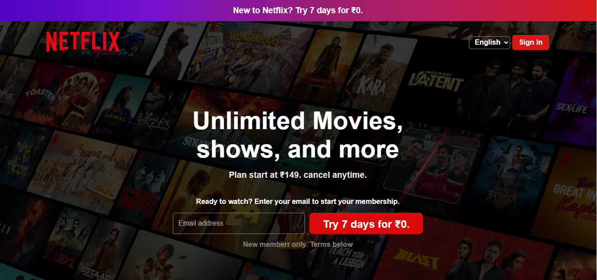
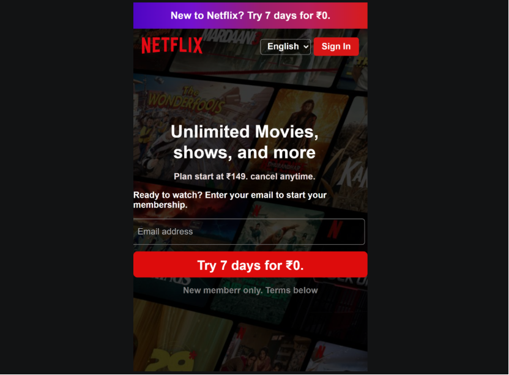

# 🎬 Netflix Landing Page Clone

A responsive **Netflix Landing Page Clone** built using **HTML5** and **CSS3**. This project recreates the look and feel of the Netflix homepage while focusing on responsive web design, clean UI, and modern CSS techniques.

---

## 📖 About the Project

This project was created to practice front-end web development using HTML and CSS. It demonstrates how to build a responsive landing page inspired by Netflix with a clean layout, modern styling, and organized code.

The project focuses on improving CSS fundamentals, responsive design, and page structure without using JavaScript.

---

## ✨ Features

- 🎨 Clean and modern user interface
- 📱 Responsive layout for different screen sizes
- 🌍 Language selection option
- 🔐 Sign In button
- 🖼️ Netflix-inspired hero section
- 📧 Email input field
- ⚡ Fast and lightweight design
- 💻 Built with clean and organized code

---

## 🛠️ Technologies Used

- HTML5
- CSS3

---

## 📂 Project Structure

```text
02-Netflix-Landing-Page-Clone/
│
├── screenshots/
│   ├── desktop.png
│   └── mobile.png
│
├── index.html
├── style.css
├── Netflix-background.jpg
├── Netflix-logo.svg
└── README.md

```

---

### 1️⃣ Clone the Repository

```bash
git clone https://github.com/heyrohitdev/css-clone-projects.git
```

### 2️⃣ Open the Project Folder

Navigate to the project directory.

### 3️⃣ Run the Project

Simply open the **index.html** file in your web browser.

No additional installation or dependencies are required.

---

## 💻 Usage

Open the project in your browser and explore the responsive Netflix landing page.

You can also resize the browser window to see how the layout adapts to different screen sizes.

---

## 📸 Screenshots

### 🖥️ Desktop View



### 📱 Mobile View



---

🌐 **Live Demo**

👉 [View Project Live](https://heyrohitdev.github.io/css-clone-projects/02-Netflix-Landing-Page-Clone/)

---

## 🔮 Future Improvements

- ⚙️ Add JavaScript functionality
- 🎞️ Add smooth animations
- 🌙 Add Dark Mode support
- 📱 Improve mobile responsiveness
- 🔑 Create a Login Page
- 🔥 Add Firebase Authentication

---

## 📚 What I Learned

While building this project, I practiced:

- HTML page structure
- CSS Flexbox
- CSS Grid
- Responsive Web Design
- Media Queries
- CSS Positioning
- Background Images
- UI Layout Design
- Clean Code Organization

---

## 🤝 Contributing

Suggestions and feedback are always welcome.

If you'd like to improve this project, feel free to fork the repository and submit a pull request.

---

## 📄 License

This project was created for learning and educational purposes.

---

## 👨‍💻 Author

**Rohit Chaudhary**

🌐 GitHub: https://github.com/heyrohitdev

---

## ⭐ Support

If you found this project helpful, please consider giving it a ⭐ on GitHub.

Your support motivates me to build more projects and continue improving my development skills.

Thank you for visiting this repository!

Happy Coding! 🚀
