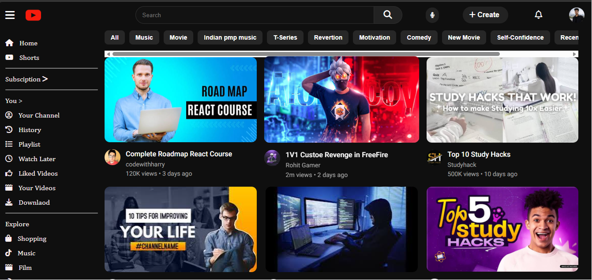
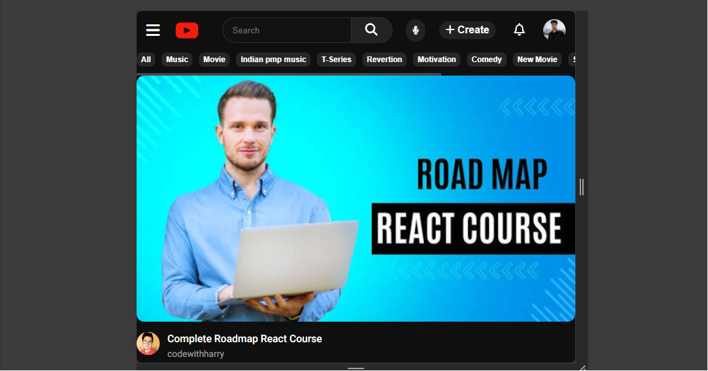

# 📺 YouTube Homepage Clone

A responsive **YouTube Homepage Clone** built using **HTML5** and **CSS3**. This project recreates the modern YouTube homepage interface with a clean layout, responsive design, sidebar navigation, category buttons, and a video section while improving HTML and CSS skills.

---

## 📖 About

This project was created to strengthen my frontend development skills by recreating the YouTube homepage. It focuses on writing clean HTML, organizing CSS effectively, and building responsive layouts inspired by the original YouTube website.

---

## ✨ Features

- 📱 Responsive Layout
- 🎨 Modern YouTube-inspired UI
- 🧭 Navigation Bar
- 📂 Sidebar Navigation
- 🔍 Search Bar
- 🎬 Video Section
- 🏷️ Category Buttons
- 🖱️ Hover Effects
- 🎯 Font Awesome Icons
- 📐 Flexbox-based Layout

---

## 🛠️ Technologies Used

- HTML5
- CSS3
- Font Awesome

---

## 📷 Screenshots

### 💻 Desktop View



### 📱 Mobile View



---

## 📂 Folder Structure

```text
youtube-homepage-clone/
│
├── index.html
├── style.css
├── README.md
│
└── images/
    ├── youtube-logo.png
    ├── profile-logo.jpg
    ├── thumbnail1.jpg
    ├── thumbnail2.jpg
    ├── thumbnail3.jpg
    ├── thumbnail4.jpg
    ├── thumbnail5.jpg
    ├── thumbnail6.jpg
    ├── channel1.jpg
    ├── channel2.jpg
    ├── channel3.jpg
    ├── channel4.jpg
    ├── channel5.png
    └── channel6.jpg
```

---

## 🌐 Live Demo

https://heyrohitdev.github.io/css-clone-projects/03-youtube-homepage-clone

---

## 🚀 Future Improvements

- Add JavaScript functionality
- Improve responsiveness for all screen sizes
- Replace the homepage screenshot with individual video cards
- Add smooth animations and transitions
- Improve accessibility
- Make the design even closer to the official YouTube homepage

---

## 👨‍💻 Author

**Rohit Chaudhary**

GitHub: **heyrohitdev*

---

## ⭐ Support

If you found this project helpful, consider giving this repository a **⭐ Star**.

It motivates me to build more frontend projects.
