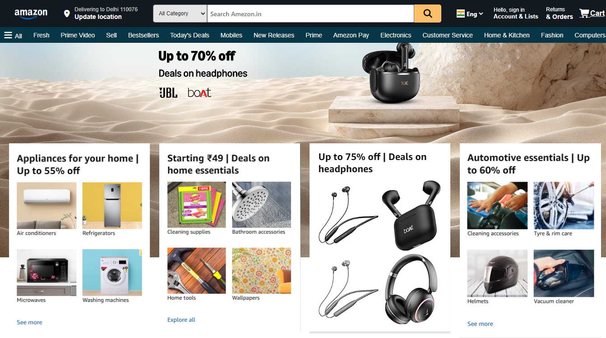

# Amazon Homepage Clone

A frontend clone of the Amazon homepage created using **HTML and CSS**.
This project focuses on recreating Amazon's desktop homepage layout, including navigation, search bar, product sections, and product cards.

---

## About Project

The Amazon homepage has a unique design compared to other e-commerce websites.
In this project, I recreated the Amazon homepage UI from scratch using HTML and CSS without using any original Amazon source code.

The main focus of this project was to practice:

* Layout designing
* CSS positioning
* Flexbox
* Grid system
* Styling and UI recreation

---

## Technologies Used

* HTML5
* CSS3

---

## Features

* Amazon-style navigation bar
* Search bar with category selection
* Product cards section
* Sign-in option UI
* Location section
* Product categories
* Responsive layout (coming soon)

---

## Folder Structure

```
Amazon-Homepage/
│
├── images/
│   ├── product-images
│   ├── banner-images
│   └── other assets
│
├── index.html
│
└── style.css
```

---

## Screenshot

### Desktop View



---

🌐 **Live Demo**

👉 [View Project Live](https://heyrohitdev.github.io/css-clone-projects/05-Amazon-Homepage/)

---

## Future Improvements

* Make fully mobile responsive
* Add JavaScript functionality
* Add product slider
* Add search functionality
* Improve animations and user interactions

---

## Author

**Rohit Chaudhary**
