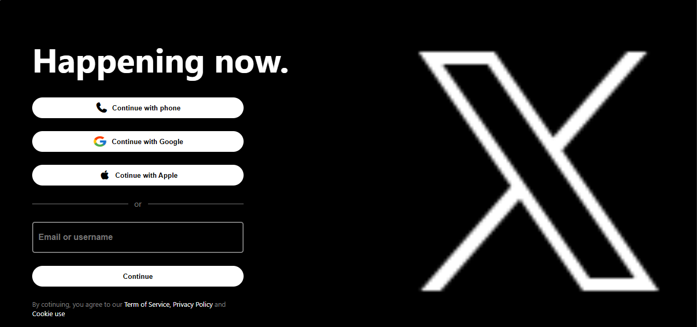
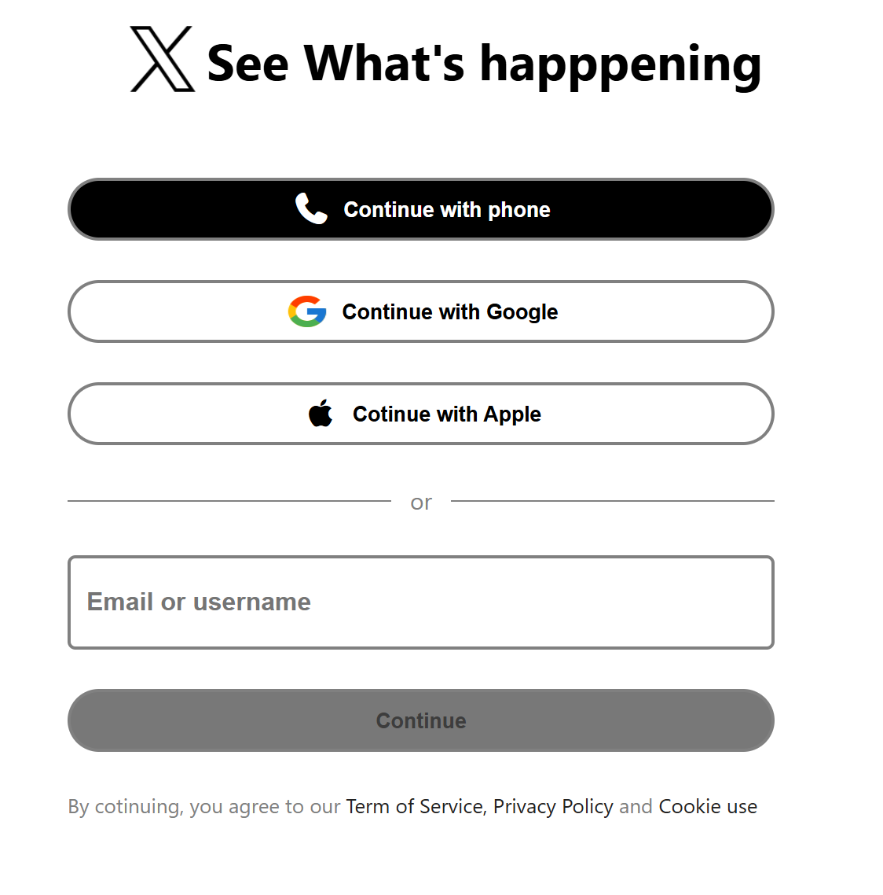
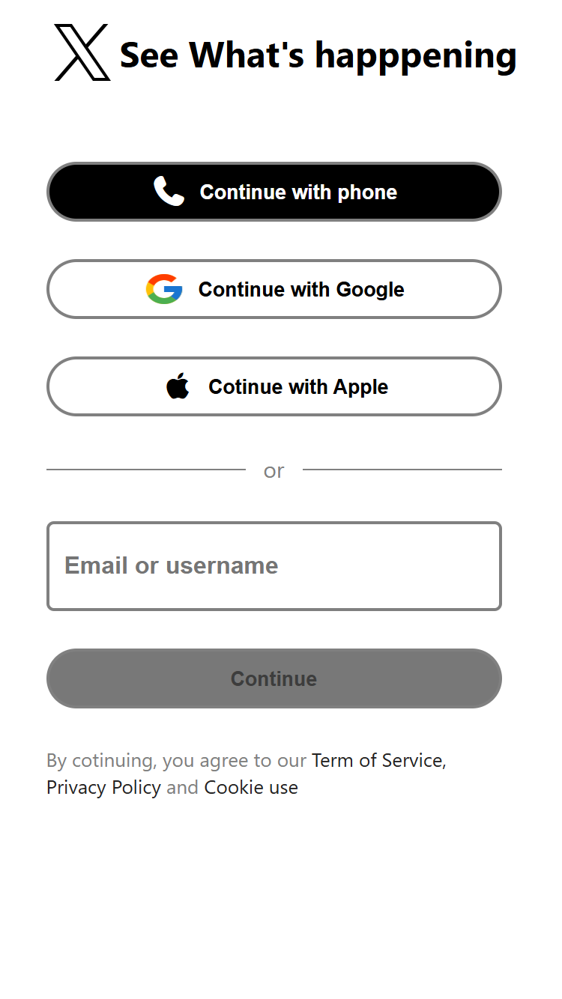

# 🐦 Twitter Homepage Clone

A responsive **Twitter (X) Homepage Clone** built using **HTML5** and **CSS3**. This project is designed with a clean folder structure, responsive layout, and organized code to follow professional front-end development practices.

---

## 🚀 About

This project recreates the Twitter (X) homepage UI with a fully responsive design. It adapts smoothly across **Mobile**, **Tablet**, and **Desktop** devices while maintaining a clean and modern user interface.

---

## ✨ Features

- 📱 Fully Responsive Design
- 📞 Continue with Phone Button
- 🔵 Continue with Google Button
- 🍎 Continue with Apple Button
- 📧 Email Input Field
- 🔒 Privacy Policy Section
- 🎨 Clean & Modern UI
- ⚡ Organized and Professional Code Structure

---

## 🛠️ Tech Stack

- HTML5
- CSS3

---

## 📂 Folder Structure

```
Twitter-Homepage/
│
├── index.html
├── style.css
├── google.png
├── twitter.png
│
└── Screenshot/
    ├── desktop-responsive.png
    ├── tablet-responsive.png
    └── mobile-responsive.png
```

---

## 🌐 Live Demo

👉 **Click Here:**  
https://heyrohitdev.github.io/css-clone-projects/06-Twitter-Homepage/

---

## 📸 Screenshots

### 💻 Desktop



---

### 📱 Tablet



---

### 📱 Mobile



---

## 🎯 Purpose

This project was created to:

- 📐 Understand Responsive Web Design
- 🎨 Improve HTML & CSS Skills
- 📱 Learn Mobile-First Development
- 💻 Practice Professional Code Structure
- 🚀 Build a Portfolio-Ready Frontend Project

---

## 🔮 Future Improvements

- ✨ Add JavaScript Functionality
- 🌙 Dark/Light Mode
- 🔐 Form Validation
- ♿ Improve Accessibility
- ⚙️ Better Animations & Transitions

---

## 👨‍💻 Author

**Rohit Chaudhary**

🌐 GitHub: https://github.com/heyrohitdev

---

## ⭐ Support

If you like this project, don't forget to **⭐ Star** the repository.

Happy Coding! 🚀
